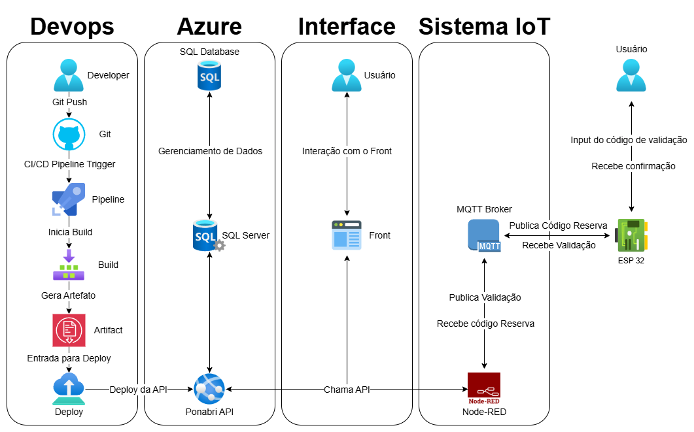

# Ponabri API - CI/CD e Infraestrutura na Nuvem com Azure DevOps

Este documento descreve a arquitetura e o processo de DevOps implementados para o projeto Ponabri API, detalhando a Integração Contínua (CI) e a Entrega Contínua (CD) utilizando Azure Pipelines para implantar a API .NET no Azure App Service com um Banco de Dados SQL do Azure.

## 1. Checklist de Requisitos da Disciplina 'DevOps Tools & Cloud Computing' (Opção 3)

| Requisito da Disciplina                                                                 | Atendido? | Justificativa / Evidência no Projeto Ponabri                                                                                                                                                           |
| :-------------------------------------------------------------------------------------- | :-------- | :----------------------------------------------------------------------------------------------------------------------------------------------------------------------------------------------------- |
| Descrever brevemente o projeto e seus objetivos                                       | Sim       | A seção "Visão Geral do Projeto Ponabri" abaixo detalha o projeto e seus objetivos.                                                                                       |
| Desenhar a Arquitetura do projeto                                          | Sim       | O diagrama de arquitetura inserido na seção "Arquitetura de DevOps" ilustra o fluxo de CI/CD e a infraestrutura na nuvem.                                                                               |
| Criar a Pipeline com Build e Deploy, e o Banco de Dados em nuvem                     | Sim       | Pipeline (`azure-pipelines.yml`) para build e deploy da API .NET funcional; Banco de Dados SQL do Azure (`PonabriDB` no servidor `ponabri-sqlserver`) criado e configurado para uso pela API na nuvem. |
| Link do projeto no GitHub com fonte, arquivo YML e apresentação do Projeto (README) | Sim       | Este README, o código-fonte da API .NET está no `https://github.com/JMafuso/ponabri-net`, e o arquivo `azure-pipelines.yml` neste repositório, já o link para o vídeo está disponível no arquivo `.zip` da Global Solutions no `Ponabri.pdf`.                 |
| Realizar testes EM NUVEM de todo projeto (vídeo)                                      | Sim       | O vídeo de demonstração que está no `.pdf` mostra a pipeline, a API rodando no Azure na URL `https://ponabriapiapp-ggdbf5fagphpfzc8.brazilsouth-01.azurewebsites.net` e a persistência de dados no Banco SQL da Azure. |

---

## 2. Visão Geral do Projeto Ponabri API

O Ponabri API é o backend do sistema Ponabri, uma plataforma projetada para facilitar o gerenciamento de abrigos temporários e a coordenação de reservas em situações de emergência ou desastres naturais. Seu objetivo principal é gerenciar Usuários, Abrigos e Reservas. Para garantir a entrega contínua de novas funcionalidades e correções, foi implementado um processo de DevOps utilizando Azure Pipelines. Este processo automatiza o build da aplicação .NET, a criação de um artefato de deploy e a implantação em um ambiente de nuvem no Microsoft Azure, composto por Azure App Service para hospedar a API e Azure SQL Database para persistência dos dados.

---

## 3. Arquitetura de DevOps

A arquitetura de DevOps para o projeto Ponabri foi desenhada para um fluxo automatizado desde o controle de versão até a implantação na nuvem, integrando a API .NET com seus serviços de backend e permitindo interações com sistemas externos como o de IoT e interfaces de usuário.

**Componentes Chave da Arquitetura DevOps:**
* **GitHub:** Repositório para o código-fonte da API .NET.
* **Azure Pipelines:** Orquestrador de CI/CD, responsável pelo build e deploy automatizados.
* **Azure App Service:** Plataforma de hospedagem da API Ponabri `PonabriApiApp`.
* **Azure SQL Database:** Banco de dados relacional `PonabriDB` no servidor `ponabri-sqlserver` para a API.

---

## 4. Pipeline de CI/CD com Azure Pipelines (`azure-pipelines.yml`)

O arquivo `azure-pipelines.yml`, localizado na raiz do repositório, define o processo automatizado de build e deploy.

**Fonte de Código:** A pipeline é configurada para ser acionada por pushes na branch `main` do repositório GitHub.

**Variáveis Principais:**
* `dotnetSdkVersion`: `'8.0.x'`(especificando a versão do SDK .NET para a build).
* `buildConfiguration`: `'Release'`.
* `projectPath`: `/Ponabri.Api.csproj`(caminho para o projeto da API).
* `artifactName`: `'ponabri-api-artifact'`(nome do pacote gerado pelo build).
* `azureSubscription`: `'AzurePonabriConnection'`(Nome da Conexão de Serviço no Azure DevOps para autenticação com a assinatura da Azure).
* `webAppName`: `'PonabriApiApp'`(Nome do Azure App Service na Azure ).
* `resourceGroupName`: `'rg-ponabri-dev'`(Nome do Resource Group no Azure onde os serviços estão).

**Estágio de Build (`Build .NET App`):**
1.  **Configuração do Ambiente:** Seleciona e configura a versão correta do .NET SDK.
2.  **Restauração de Dependências:** Executa `dotnet restore`.
3.  **Compilação:** Executa `dotnet build --configuration $(buildConfiguration) --no-restore`.
4.  **Publicação:** Executa `dotnet publish --configuration $(buildConfiguration) --output $(Build.ArtifactStagingDirectory)/api --no-build` e utiliza `zipAfterPublish: true` para gerar um pacote `.zip` `Ponabri.Api.zip`.
5.  **Publicação do Artefato:** O pacote `.zip` gerado é publicado como um artefato da pipeline `ponabri-api-artifact`.

**Estágio de Deploy (`Deploy to Azure App Service`):**
1.  **Dependência:** Este estágio é executado somente após o sucesso do estágio de Build.
2.  **Implantação:** Utiliza a tarefa `AzureWebApp@1` para implantar o artefato (`$(Pipeline.Workspace)/$(artifactName)/Ponabri.Api.zip`) no Azure App Service.
3.  **Configurações de Aplicativo:** As "Application Settings" do Azure App Service, como `ConnectionStrings__DefaultConnection` (para o Azure SQL Database) e as `JwtSettings` (Key, Issuer, Audience) para produção, são configuradas/atualizadas durante este estágio, lendo valores de variáveis secretas definidas no Azure Pipelines `$(ConnectionStringSQLAzure)`, `$(JwtProdKey)`.

---

## 5. Configuração dos Serviços no Azure

* **Azure App Service (`PonabriApiApp`):**
    * A API .NET (versão 8.0.410) está hospedada neste serviço.
    * A URL pública para acesso à API é: `https://ponabriapiapp-ggdbf5fagphpfzc8.brazilsouth-01.azurewebsites.net`
    * As "Application Settings" no portal do Azure (ou configuradas via pipeline) sobrescrevem o `appsettings.json` para o ambiente de produção, gerenciando strings de conexão e outras chaves secretas.
* **Azure SQL Database (`PonabriDB`):**
    * É o banco de dados relacional utilizado pela API quando está em execução no Azure, hospedado no servidor `ponabri-sqlserver.database.windows.net`.
    * O firewall do servidor SQL está configurado para:
        * Permitir acesso de "Serviços do Azure" (para que o App Service possa se conectar).
        * Permitir o acesso do IP do desenvolvedor (para aplicar migrations do EF Core ou gerenciar o banco diretamente durante o desenvolvimento).

---

## 6. Testes em Nuvem e Vídeo de Demonstração

Um vídeo de demonstração(com acesso somente através do arquivo .pdf) acompanha esta documentação para evidenciar o funcionamento do pipeline de CI/CD e da aplicação Ponabri API na nuvem.

**Principais Pontos Demonstrados no Vídeo:**
1.  **Azure DevOps:** Visualização do pipeline YAML e uma execução bem-sucedida, mostrando os logs dos estágios de Build e Deploy.
2.  **Portal do Azure:** Apresentação dos recursos provisionados (Azure App Service, Azure SQL Database) e verificação das "Application Settings" no App Service.
3.  **Teste Funcional da API via Swagger (na URL do Azure):**
    * Demonstração do fluxo de registro de um novo usuário.
    * Realização de login para obtenção de um token JWT.
    * Utilização do token JWT para autorizar o acesso a um endpoint protegido (ex: criação de um Abrigo via `POST /api/Abrigos`).
    * Busca do recurso recém-criado (`GET /api/Abrigos/{id}`) para confirmar a persistência dos dados no Azure SQL Database.
    * Demonstração da chamada ao endpoint de validação de reserva do IoT (`GET /api/Reservas/VALIDACAO/{codigoReserva}`).

---